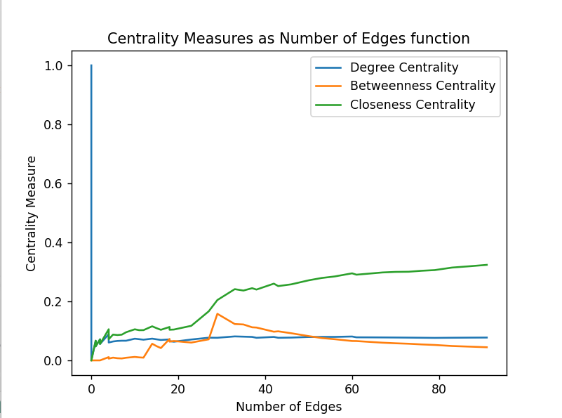
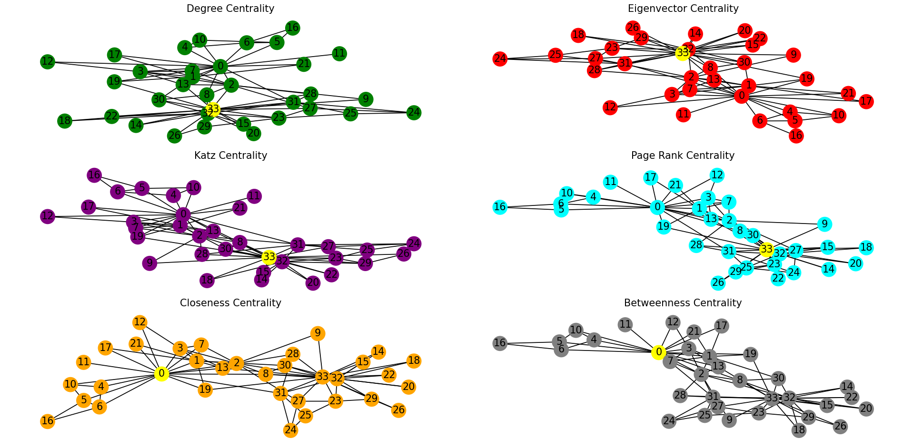

# Social Network Analysis program
These are the programs used to analyze the social network. They were developed as part of the Introduction to Social Network Analysis course. The requirements for the programs are as follows:
* Laboratory sessions:
  + Lab 1: Solution: [lab1.py](lab1.py)
    
    1) Write a full graph of 50 nodes where from each node, there is a link (either in-going or out-going links) to one to 4 other nodes, taken at random, of your choice. 
    Use a labelling of your choice to label each node of the network.
      - Use a visualization tool to display the graph
      - Use a visualization of your choice to display the nodes each node is linked to
      - Calculate the degree centrality of each node and the average degree of the graph  (use appropriate functions in 
        NetworkX) and display their values
      - Draw the degree distribution plot and comment on whether the power-law distribution is fit 
      - Test other centrality measures available in NetworkX and display their values, and store the centrality values 
          in a vector
      - write a script that randomly removes one node from the above graph
      - Repeat the process a)-d)  until the number of nodes in the graph is equal to one.
      - Display a graph showing the variations of the various centrality measures as a function of the number of 
    edges in the graph.  
    2) Use the provided dataset karate_club_coords.pkl.   
    Write a program that 
      - Inputs the above dataset
      - Displays the adjacency matrix of this graph and the network associated to this dataset
      - Calculates the degree centrality of each node and store them in an array vector
      - Identifies potential regular graphs in the network. 
      - Uses appropriate NetworkX functions to identify the largest component of the graph, and smallest component. 
      - Draw the degree distribution of this component (subgraph of d)). 
      - Use appropriate NetworkX functions to compute the diameter of the whole network and diameter of the largest component.
  + Lab 2: Solution: [lab2.py](lab2.py)
    
      1) Write a program that
         - Displays the whole graph
         - Displays the degree centrality, eigenvector centrality, Katz centrality, page rank centrality of each node of the network. Draw the network graph where the node with the highest centrality is highlighted (use different color for
            each centrality type)
         - Draws the distribution (histogram) for each centrality measure
         - Repeat b) and c) when using closeness centrality, betweenness centrality
         - Displays the local clustering coefficient of each node, and draws the corresponding distribution function. Then compare possible link between clustering coefficient values and some centrality measures when scrutinizing the values
         of clustering coefficient/centrality measures of individual nodes.
         - Calculates the global clustering coefficient of the overall graph (or its largest connected componenty).
         - Identify smallest subgraph that has a global clustering coefficient close to the one of the whole graph.  
         - Identify a subgraph, which is bipartie graph 
      2) Consider the eggo-Facebook dataset, available at https://snap.stanford.edu/data/ego-Facebook.html
         Write a program that
         - Calculates the degree, closeness and in-betweeness centrality of each node of the network, and displays the corresponding distribution (histogram)
         - Calculates the shortest distance between node (s) of highest centrality score and node (s) of second highest centrality score (for both degree, closeness, in-betweeness centraility measures)
         - Displays the subgraph where the nodes are most connected (in terms of degree centrality).. Can use your own reasoning for this issue
         - Calculates the local clustering coefficients and the shortest distance among the nodes with highest and second highest clustering coefficient.
         - Checks whether Power-law distribution is fitted
